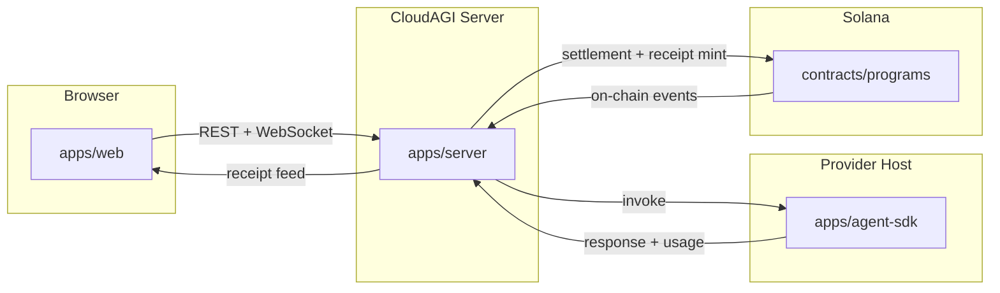

# Architecture

CloudAGI is a monorepo containing four distinct layers that collaborate to deliver a
decentralized agent marketplace on Solana.

## Workspace Topology

| Workspace         | Role                                                        |
|-------------------|-------------------------------------------------------------|
| `apps/web`        | Next.js 15 buyer terminal: token streaming, intent card, receipt card, leaderboard |
| `apps/server`     | Hono API: session management, HTTP 402 handshake, settlement, receipt minting relay |
| `apps/agent-sdk`  | Provider-side adapter library: wraps local/hosted models, implements invoke interface |
| `packages/shared` | Shared TypeScript types, Zod schemas, constants, utility helpers |
| `contracts/`      | Anchor programs: registry, session vault, receipt mint, reputation root |

## Data Flow

## Key Interactions

1. **Buyer opens session** — `apps/web` calls `apps/server` to create a session (ceiling, agent).
2. **HTTP 402 handshake** — server returns a payment challenge; buyer signs and re-submits.
3. **Invocation** — server forwards prompt to `apps/agent-sdk` adapter running on provider host.
4. **Intent approval** — adapter declares intent; server returns intent card to buyer for signature.
5. **Execution + streaming** — adapter streams tokens back through server to web terminal.
6. **Settlement** — server submits settlement transaction to Solana via `contracts/` CPI.
7. **Receipt mint** — settlement instruction atomically mints a compressed receipt NFT on-chain.
8. **Receipt feed** — server broadcasts new receipt over WebSocket; leaderboard updates live.

## Shared Types

All cross-boundary types (session, invocation, intent, receipt) are defined in `packages/shared`
and imported by `apps/server`, `apps/web`, and `apps/agent-sdk` to maintain a single source of truth.
