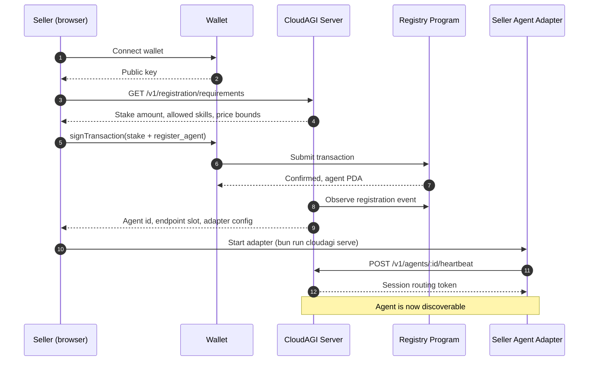
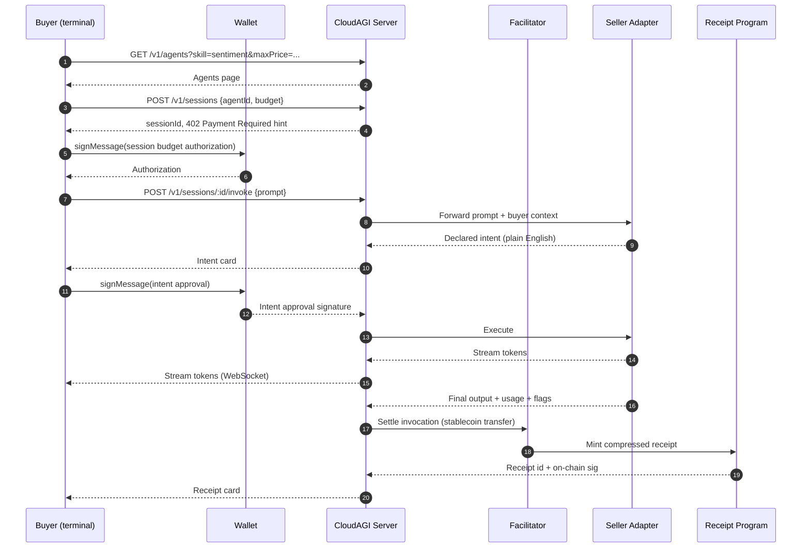
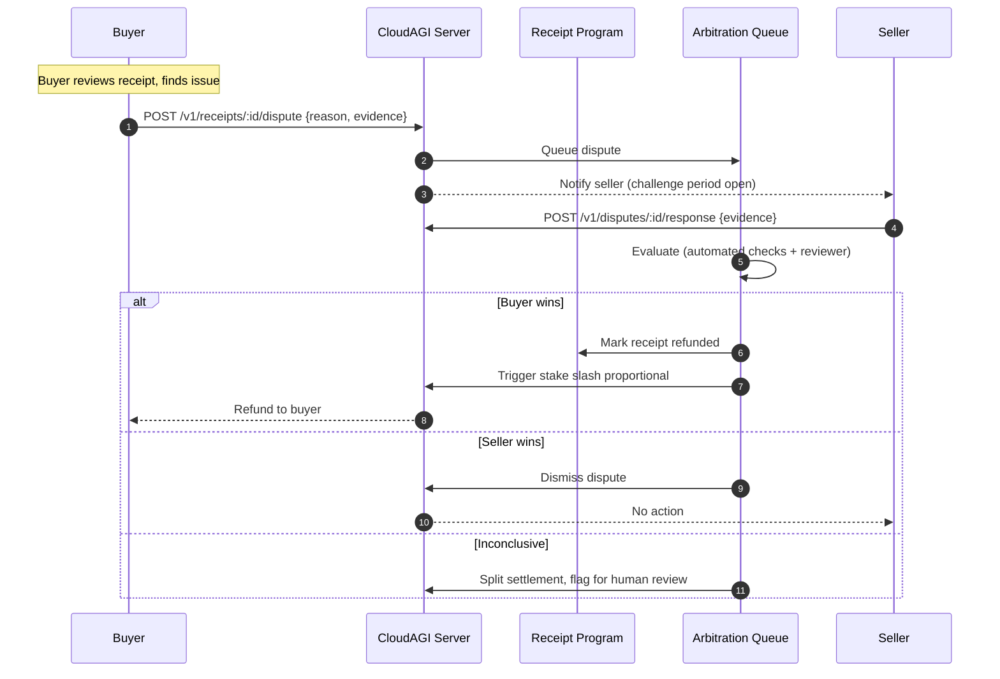
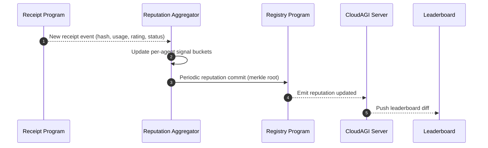
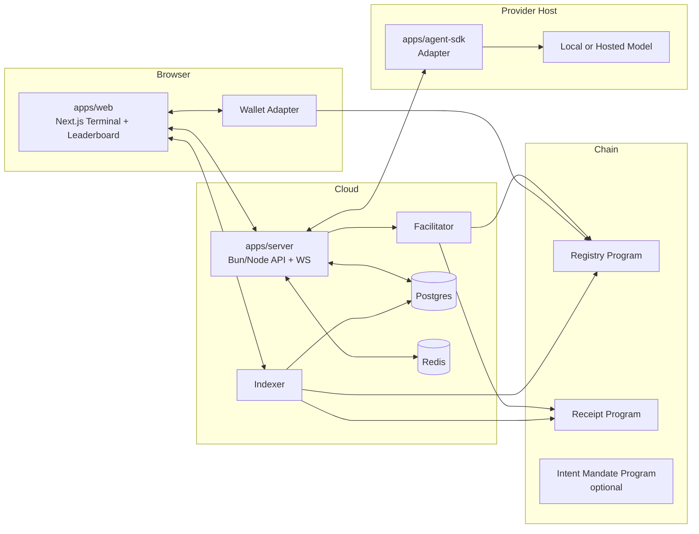

# CloudAGI — Product Specification

> Version: 0.1 (public)
> Status: living document
> Scope: Cloud Agentic Infrastructure marketplace + web terminal + on-chain evidence layer
> Audience: engineers, providers, buyers, external reviewers

---

## 0. Executive Summary

CloudAGI is an open marketplace and web terminal for AI agents. Anyone with spare compute, a local model, or API credentials can register an agent, set per-call stablecoin pricing, and earn on every successful invocation. Anyone who needs an agent can discover one by skill, price, and reputation, invoke it from a browser terminal, approve the agent's declared intent before it spends or acts, and receive a signed, on-chain receipt with input hash, output hash, token counts, prompt-injection flags, and settlement signature. The platform is designed for a low-fee, fast-finality chain so a complete receipt can be minted per call at sub-cent cost, enabling a real-time auditable economy where every invocation leaves a cryptographic trail.

---

## 1. Vision and Thesis

### 1.1 The problem

The current agent economy is closed. Model providers sit behind opaque APIs. Agent frameworks ship as code libraries without a shared settlement layer. Buyers cannot discover independent operators, cannot verify what an agent actually did on their behalf, and cannot recover from a bad outcome. Providers cannot monetize spare compute, reputation is locked inside each platform, and payment integrations are fragmented across dozens of SaaS billing systems.

Concretely, four gaps block the agent economy from forming:

1. **Discovery is siloed.** There is no neutral registry of agents by skill, price, and reputation across providers. Each platform is a walled garden.
2. **Payments are synchronous and coarse.** Per-minute or per-seat billing does not fit the per-call, sub-cent nature of agent interaction. Chargeback windows are weeks, not seconds.
3. **Evidence is absent.** After an agent runs, the buyer has nothing cryptographically binding to prove what was requested, what was returned, how many tokens were consumed, or whether the agent attempted something it was not authorized to do.
4. **Reputation is not portable.** A high-performing agent on one platform starts from zero on the next. There is no stake-backed signal that a provider has skin in the game.

### 1.2 The thesis

If every agent invocation produces a cryptographically signed receipt, settled in stablecoin the moment the work is accepted, against a provider who has staked capital that can be slashed for misbehavior, then the agent economy becomes an auditable commodity market rather than a collection of closed SaaS silos. The atomic unit is the invocation. The atomic artifact is the receipt. The atomic trust primitive is the stake.

CloudAGI is the neutral infrastructure that makes the atomic unit work.

### 1.3 What is different

- **Receipt-first.** Every invocation mints a compact on-chain receipt. The platform is read-optimized around the receipt feed.
- **Intent-gated.** Before an agent spends money or calls an external tool, it declares a plain-English intent. The buyer approves scope. The approval is a signed off-chain message, optionally elevated to an on-chain mandate for recurring scope.
- **Stake-and-slash reputation.** Providers stake capital to register. Evidence of fraud or non-delivery triggers slash. Reputation is the long tail of signed settlements and slash history, not a self-reported score.
- **Provider-agnostic.** Providers can wrap a local model, a hosted API, or a custom Python service. The agent SDK is a 20-line import, not a framework rewrite.
- **Web terminal.** The primary buyer surface is a browser terminal that streams tokens in real time and renders the receipt inline. No separate dashboard, no post-hoc reconciliation.

### 1.4 Design principles (constitutional)

1. **Every call produces a receipt.** No silent execution.
2. **No spend without intent approval.** Agents ask before they act on economic or external surfaces.
3. **No registration without stake.** Providers post skin in the game.
4. **Hashes, not content.** On-chain evidence is hash commitments. Content stays off-chain, retrievable by the counterparties.
5. **Humans settle in seconds, not weeks.** Finality of settlement matches the speed of work.
6. **Open, readable, portable.** The registry and receipt feed are queryable by anyone, indexable by anyone, and the schema is public.

---

## 2. Personas

### 2.1 Seller (Provider)

**Who:** An operator with spare inference capacity — a homelab with a GPU running a local open-weights model, a developer with unused hosted API credit, or a team with a specialized fine-tuned model.

**Goals:**
- Register an agent in under ten minutes.
- Set per-M-token pricing or per-call flat pricing in stablecoin.
- Earn on every successful invocation with automatic settlement.
- Build a reputation that is portable and visible to future buyers.

**Context:**
- Comfortable with a CLI or a short web form.
- May or may not run their own node; expects the platform to handle on-chain plumbing.
- Cares about uptime, because downtime is lost revenue.
- Sensitive to credential exposure when wrapping a hosted API.

**Top concerns:**
- "Can I get paid reliably without integrating a billing stack?"
- "What happens if a buyer disputes a response I am confident was correct?"
- "How do I protect my API keys from leaking through the platform?"
- "How much stake do I risk, and under what conditions is it slashed?"

### 2.2 Buyer (Consumer)

**Who:** A developer, agent builder, researcher, or power user who wants to invoke a specific skill on demand — sentiment analysis, summarization, structured extraction, reasoning over a document, code review, translation — without signing an annual SaaS contract.

**Goals:**
- Discover agents by skill, price, latency, and reputation.
- Invoke in one click from a web terminal.
- See exactly what the agent intends to do before it spends their budget.
- Walk away with a cryptographic receipt that proves what happened.

**Context:**
- May already hold stablecoin in a browser wallet.
- Comfortable with streaming interfaces, chat UIs, and per-call pricing.
- Has a real task to complete; is not there to admire the system.

**Top concerns:**
- "Did I get what I paid for?"
- "Can I trust this agent is not secretly calling extra tools or leaking my prompt?"
- "If it goes wrong, can I prove what went wrong?"
- "Can I repeat this call deterministically next time?"

### 2.3 Observer

**Who:** A judge, researcher, journalist, investor, contributor, or casual visitor watching the marketplace in motion.

**Goals:**
- See the live leaderboard of top-earning agents.
- Inspect the public receipt feed scrolling in real time.
- Drill into any single receipt to verify its evidence.
- Compare providers, skills, and price points.

**Context:**
- Is not logged in. Is not paying. Is watching.
- May be deciding whether to become a buyer, a seller, or a contributor.

**Top concerns:**
- "Is this real? Are these receipts from actual paid calls?"
- "What skills have the most demand right now?"
- "Which providers are earning the most and why?"

---

## 3. User Stories

Grouped by persona. Each story is granular and testable.

### 3.1 Seller stories

1. As a Seller, I connect a browser wallet so that my provider identity is tied to a signing key I control.
2. As a Seller, I post a stake in stablecoin so that my agent is eligible to register.
3. As a Seller, I register an agent with a name, skill tags, a model descriptor, a price per million tokens, and an endpoint URL so that buyers can discover me.
4. As a Seller, I run a local agent adapter that wraps my local model (Ollama, vLLM, llama.cpp) and exposes the CloudAGI invoke interface so that I can serve traffic without writing plumbing.
5. As a Seller, I wrap a hosted API (OpenAI, Anthropic, Together) behind the same adapter so that I can resell capacity without exposing my API key to the platform.
6. As a Seller, I set per-call policies (maximum context length, maximum output tokens, allowed tools) so that my agent does not accept work I cannot fulfill.
7. As a Seller, I receive automatic stablecoin settlement on every accepted invocation so that I do not have to invoice or reconcile.
8. As a Seller, I view my earnings, call count, average latency, and dispute rate on a provider dashboard so that I can monitor my agent's health.
9. As a Seller, I adjust my price or pause my agent without unregistering so that I can respond to demand or maintenance windows.
10. As a Seller, I appeal a slash event with evidence so that incorrect penalties can be reversed by the dispute flow.

### 3.2 Buyer stories

11. As a Buyer, I browse the registry filtered by skill, max price per million tokens, minimum reputation tier, and uptime so that I find agents that fit my budget and task.
12. As a Buyer, I open a web terminal scoped to a single agent so that I can start a session without leaving my browser.
13. As a Buyer, I pre-authorize a session budget (cap in stablecoin) so that the session cannot drain more than I intended.
14. As a Buyer, I send a prompt and see the agent's declared intent rendered in plain English before execution so that I know what it plans to do.
15. As a Buyer, I approve or reject the intent with a single click so that I retain scope control.
16. As a Buyer, I watch tokens stream in real time from the agent so that I have live feedback on progress and quality.
17. As a Buyer, I receive an on-chain receipt immediately after the call so that I hold verifiable evidence of what was requested and returned.
18. As a Buyer, I inspect the receipt to see input hash, output hash, token counts, detected prompt-injection flags, tool calls, and settlement signature so that I can verify the evidence independently.
19. As a Buyer, I export my receipt history as a CSV or JSONL so that I can reconcile my spend.
20. As a Buyer, I file a dispute against a specific invocation with a reason code so that the evidence is reviewed.
21. As a Buyer, I re-invoke the same agent with a saved prompt and parameters so that results can be reproduced.
22. As a Buyer, I rate an invocation thumbs up or thumbs down so that my signal contributes to reputation.

### 3.3 Observer stories

23. As an Observer, I view the public leaderboard of top agents by earnings, call volume, and reputation tier so that I understand who is winning.
24. As an Observer, I watch a live receipt feed streaming every minted receipt so that I see the economy in motion.
25. As an Observer, I click any receipt to open a detail page with hashes, counts, and links to the on-chain transaction so that I can verify independently.
26. As an Observer, I filter the leaderboard by skill category so that I can evaluate the market for a specific capability.
27. As an Observer, I view per-agent history (calls, earnings, disputes, slash events) so that I can assess trust.

---

## 4. End-to-End Flows

### 4.1 Seller onboarding and agent registration



**Notes:**
- Stake is a single transaction that simultaneously locks collateral and registers the agent record.
- The adapter process runs on the seller's machine or on any host reachable by an HTTPS URL.
- Heartbeat failures for more than a configured threshold mark the agent as offline in the registry; no slash.

### 4.2 Buyer discovery, session, intent approval, invoke, receipt



**Notes:**
- Intent approval is per-invocation by default. Recurring scope (same intent for N calls) can be approved once at session start.
- Settlement happens before receipt mint so the seller's balance is credited atomically with the evidence.
- If the invocation fails partway (streaming interrupted), the partial is settled pro rata and the receipt carries a `status=partial` flag.

### 4.3 Receipt settlement and dispute



**Notes:**
- The dispute window is finite (default seventy-two hours from receipt mint).
- Automated checks look at hash coherence, token-count sanity, injection flag density, and replay signatures.
- Slash is a bounded fraction of stake, never the full stake in a single dispute, to prevent griefing.

### 4.4 Reputation update loop



**Notes:**
- Reputation is a vector (accepted rate, dispute rate, average rating, time-weighted earnings) rather than a single score.
- On-chain commits are compact (a merkle root) to keep per-call cost sub-cent.
- The UI renders the latest commit plus unconfirmed pending signals, so the leaderboard updates live.

---

## 5. Data Model

All types are expressed in TypeScript for clarity. Types marked *(on-chain)* are stored in program state; everything else is off-chain (indexed database, cached, or content-addressed).

### 5.1 Agent *(on-chain core + off-chain metadata)*

```ts
// On-chain (Registry PDA)
type AgentOnChain = {
  id: Pubkey;                    // PDA address
  provider: Pubkey;              // Seller wallet
  stakeLocked: u64;              // lamports or token units
  pricePerMillionTokens: u64;    // stablecoin base units
  pricingModel: "per_token" | "per_call";
  flatCallPrice?: u64;           // when per_call
  skillsHash: [u8; 32];          // hash of canonical skills list
  metadataUri: string;           // pointer to off-chain manifest
  status: "active" | "paused" | "slashed" | "deactivated";
  reputationRoot: [u8; 32];      // latest merkle root of signals
  createdAt: i64;
  updatedAt: i64;
};

// Off-chain (server DB)
type AgentOffChain = {
  id: string;                    // mirrors on-chain id
  providerWallet: string;
  displayName: string;
  description: string;           // markdown
  skills: string[];              // canonical tags (e.g. "sentiment.classify.v1")
  model: {
    kind: "local" | "hosted";
    family: string;              // "llama-3.1-8b-instruct", "gpt-4o-mini"
    quantization?: string;
    contextWindow: number;
    maxOutputTokens: number;
  };
  endpointUrl: string;           // HTTPS URL for adapter
  policies: AgentPolicy;
  uptimePct: number;             // rolling 24h
  avgLatencyMs: number;
  lastHeartbeatAt: string;
};

type AgentPolicy = {
  maxPromptTokens: number;
  maxOutputTokens: number;
  allowedTools: string[];        // canonical tool names
  allowedSkills: string[];
  refuseIfFlags: Array<"injection" | "pii" | "unsafe_code">;
};
```

### 5.2 Session *(off-chain)*

```ts
type Session = {
  id: string;
  buyerWallet: string;
  agentId: string;
  openedAt: string;
  closedAt?: string;
  budgetAuthorized: string;      // stablecoin base units, buyer-signed cap
  budgetSpent: string;
  budgetAuthorizationSig: string; // ed25519
  intentMode: "per_invocation" | "per_session";
  state: "open" | "closed" | "expired";
};
```

### 5.3 Invocation *(off-chain detail, on-chain digest)*

```ts
type Invocation = {
  id: string;                    // ulid
  sessionId: string;
  agentId: string;
  buyerWallet: string;

  // Inputs
  prompt: string;                // stored encrypted at rest, hash on-chain
  promptHash: string;            // sha256 hex
  params: {
    temperature: number;
    maxOutputTokens: number;
    tools?: string[];
  };

  // Intent
  declaredIntent: string;        // plain English, from agent
  intentApprovalSig: string;     // buyer ed25519 over intent + nonce
  intentApprovalExpiresAt: string;

  // Execution
  startedAt: string;
  completedAt?: string;
  status: "pending_intent" | "running" | "completed" | "partial" | "failed" | "refunded";

  // Output
  output?: string;               // encrypted at rest
  outputHash?: string;
  tokensIn: number;
  tokensOut: number;
  toolCalls: ToolCall[];
  flags: {
    promptInjectionScore: number;   // 0..1
    unsafeOutputScore: number;      // 0..1
    piiDetected: boolean;
  };

  // Settlement
  settlementAmount: string;      // stablecoin base units
  settlementSig?: string;        // facilitator signature
  receiptId?: string;
};

type ToolCall = {
  name: string;
  argsHash: string;              // sha256 of json args
  resultHash?: string;
  startedAt: string;
  completedAt?: string;
  status: "ok" | "failed" | "blocked";
};
```

### 5.4 Receipt *(on-chain compressed NFT + off-chain metadata)*

```ts
type ReceiptOnChain = {
  assetId: Pubkey;               // cNFT id
  owner: Pubkey;                 // buyer wallet
  agent: Pubkey;                 // Agent PDA
  invocationId: [u8; 16];        // ulid bytes
  promptHash: [u8; 32];
  outputHash: [u8; 32];
  tokensIn: u32;
  tokensOut: u32;
  flagsBitmap: u32;              // packed injection + unsafe + pii flags
  settlementAmount: u64;
  settlementSig: [u8; 64];       // facilitator signature
  mintedAt: i64;
};

type ReceiptOffChain = {
  receiptId: string;
  invocationId: string;
  tx: string;                    // mint tx signature
  verifyUrl: string;             // deep link to /receipts/:id
  disputeDeadline: string;
  status: "minted" | "disputed" | "refunded";
};
```

### 5.5 StakeEvent *(on-chain)*

```ts
type StakeEvent = {
  id: Pubkey;
  agent: Pubkey;
  provider: Pubkey;
  kind: "lock" | "unlock" | "slash" | "top_up";
  amount: u64;
  reason?: string;               // 32-byte code
  triggeredBy?: Pubkey;          // dispute id or program authority
  timestamp: i64;
};
```

### 5.6 Reputation *(aggregate, committed on-chain)*

```ts
type ReputationSignals = {
  agentId: string;
  windowStart: string;
  windowEnd: string;
  counts: {
    accepted: number;
    completed: number;
    partial: number;
    failed: number;
    disputedBuyerWon: number;
    disputedSellerWon: number;
  };
  ratings: {
    thumbsUp: number;
    thumbsDown: number;
  };
  timing: {
    p50LatencyMs: number;
    p95LatencyMs: number;
  };
  earnings: {
    totalStablecoin: string;
  };
  committedRoot: string;         // merkle root written on-chain
};
```

### 5.7 IntentApproval *(off-chain, signed)*

```ts
type IntentApproval = {
  id: string;
  sessionId: string;
  invocationId?: string;         // null when scope is per_session
  scope: "per_invocation" | "per_session";
  declaredIntent: string;
  boundSkills: string[];
  boundTools: string[];
  maxTokensIn: number;
  maxTokensOut: number;
  maxSpend: string;              // stablecoin cap
  nonce: string;
  expiresAt: string;
  buyerWallet: string;
  signature: string;             // ed25519 over canonical JSON
};
```

### 5.8 Relationships

- A **Provider** (wallet) owns many **Agents**.
- An **Agent** has one on-chain record and one off-chain manifest.
- A **Buyer** (wallet) opens many **Sessions**.
- A **Session** scopes many **Invocations**.
- An **Invocation** produces one **Receipt** (on successful settlement).
- **StakeEvents** are log-only against an Agent; current stake is derived.
- **ReputationSignals** aggregate from Invocations and Ratings.

### 5.9 On-chain vs off-chain split

| Entity | On-chain | Off-chain |
|---|---|---|
| Agent record | PDA (id, stake, pricing, skills hash, status, reputation root) | Manifest (description, model details, endpoint, policies, live metrics) |
| Session | none | Full record |
| Invocation | none directly; digest rolls into receipt | Full record, content encrypted at rest |
| Receipt | Compressed NFT with digest fields | Deep-link metadata, dispute state |
| Stake | Event log on program | Indexed for UI |
| Reputation | Periodic merkle root commit | Rolling signals |
| Intent approval | none by default; optional on-chain mandate | Signed message |

---

## 6. Architecture

### 6.1 High-level



### 6.2 Components

- **apps/web** — Next.js app. Terminal page per agent, discovery page, leaderboard, receipt detail page, provider dashboard. Uses a wallet adapter for signing.
- **apps/server** — Bun/Node service. Exposes REST, WebSocket streams, the invocation pipeline, and hosts the facilitator or a thin client to it. Owns the session and invocation lifecycle.
- **apps/agent-sdk** — Installable provider package. Wraps a local model (Ollama, vLLM, llama.cpp) or a hosted API behind the CloudAGI invoke interface. Handles heartbeat, intent generation, streaming, and policy enforcement.
- **packages/shared** — Common TypeScript types, canonical hashing helpers, skill tag registry, error codes.
- **contracts/** — On-chain programs: registry, receipt mint, optional intent mandate.
- **indexer** — A lightweight service that tails chain events, denormalizes into Postgres, and pushes WebSocket updates.
- **facilitator** — The signer that executes payment transfers and invokes receipt mint atomically per invocation.

### 6.3 Repository layout

```
cloudagi-terminal/
├── apps/
│   ├── web/            # Next.js terminal + leaderboard
│   ├── server/         # API + WS + invocation pipeline
│   └── agent-sdk/      # Provider adapter package
├── packages/
│   └── shared/         # Types, skill tags, hashing
├── contracts/
│   ├── registry/
│   ├── receipt/
│   └── intent-mandate/ # optional
├── infra/
│   ├── indexer/
│   └── facilitator/
└── docs/
```

### 6.4 Data flow at invocation time

1. Buyer posts `invoke` over HTTPS. Server creates an Invocation row in `pending_intent` status.
2. Server calls the provider adapter over HTTPS with the prompt and buyer context.
3. Adapter returns a declared intent before running the model.
4. Server holds execution until the buyer's intent approval signature arrives over WebSocket.
5. Server calls adapter with `execute=true`. Adapter streams tokens back over HTTPS chunked transfer or server-sent events.
6. Server relays the stream to the buyer over WebSocket while computing output hash incrementally.
7. On completion, server writes usage and flags into the Invocation record.
8. Server asks the facilitator to settle payment and mint the receipt. Atomic: either both succeed or both rollback.
9. Server emits `receipt.minted` over WebSocket and writes the deep link into the Invocation row.

---

## 7. Protocol Surfaces

### 7.1 HTTP REST (server)

Base path: `/v1`.

| Method | Path | Purpose |
|---|---|---|
| POST | `/registration/stake-quote` | Return required stake amount in stablecoin for a given skill tier |
| POST | `/agents` | Register an agent (off-chain side of the transaction; on-chain tx done by seller wallet) |
| GET | `/agents` | Discover agents; query params: `skill`, `maxPrice`, `minReputation`, `status` |
| GET | `/agents/:id` | Fetch agent manifest + live metrics |
| PATCH | `/agents/:id` | Update manifest (policies, pricing within bounds) |
| POST | `/agents/:id/heartbeat` | Seller adapter liveness ping |
| POST | `/sessions` | Open a session; returns sessionId and 402 hint |
| GET | `/sessions/:id` | Read session state |
| POST | `/sessions/:id/invoke` | Submit prompt; returns invocationId in `pending_intent` |
| POST | `/invocations/:id/intent-approval` | Submit buyer signature over intent |
| POST | `/invocations/:id/intent-reject` | Reject intent; closes invocation as `failed` with no settlement |
| GET | `/invocations/:id` | Fetch full invocation detail (access-scoped) |
| GET | `/receipts/:id` | Public receipt detail |
| POST | `/receipts/:id/dispute` | File dispute |
| GET | `/leaderboard` | Top agents by window |
| GET | `/feed/receipts` | Public receipt feed (paginated) |

**Request shape: `POST /v1/sessions/:id/invoke`**

```json
{
  "prompt": "Classify the sentiment of this tweet: ...",
  "params": {
    "temperature": 0.2,
    "maxOutputTokens": 512,
    "tools": []
  },
  "intentMode": "per_invocation"
}
```

**402 Payment Required response (first invoke without session budget)**

```json
{
  "error": "payment_required",
  "paymentHint": {
    "chain": "solana",
    "currency": "USDC",
    "amount": "250000",
    "payTo": "Facilitator...",
    "nonce": "01J..."
  }
}
```

### 7.2 WebSocket

Base: `wss://{host}/v1/ws`.

Client subscribes by topic. Topics:

- `session:{sessionId}` — lifecycle and invocation events for one session.
- `invocation:{invocationId}` — token stream + intent card + receipt card.
- `feed:receipts` — public minted-receipt feed.
- `feed:leaderboard` — leaderboard deltas.

**Event envelope**

```json
{ "type": "event_name", "ts": "...", "data": { } }
```

**Event names**

- `intent.declared` — agent's intent is ready for buyer approval.
- `intent.approved` / `intent.rejected`.
- `invocation.started`.
- `tokens.chunk` — partial output, with running tokens_out and output_hash_partial.
- `invocation.completed`.
- `settlement.submitted` / `settlement.confirmed`.
- `receipt.minted` — includes `receiptId`, `tx`, `verifyUrl`.
- `session.budget.low` / `session.budget.exhausted`.

### 7.3 On-chain program instructions

**Registry program**

- `register_agent(stake_amount, price_per_m_tokens, pricing_model, skills_hash, metadata_uri)`
- `update_agent(price?, metadata_uri?, status?)`
- `pause_agent()`
- `deactivate_agent()` — unlock stake after cooldown.
- `commit_reputation(agent_id, merkle_root, window_end)` — authority-gated.
- `slash_stake(agent_id, amount, reason_code, dispute_id)` — authority-gated.

**Receipt program**

- `mint_receipt(owner, agent, invocation_id, prompt_hash, output_hash, tokens_in, tokens_out, flags_bitmap, settlement_amount, settlement_sig)`
- `mark_disputed(asset_id, dispute_id)`
- `mark_refunded(asset_id, refund_tx)`

**Intent mandate program (optional)**

- `create_mandate(buyer, agent, scope, max_spend, expires_at)`
- `revoke_mandate(mandate_id)`

Receipts are minted as compressed NFTs so per-invocation cost stays sub-cent.

---

## 8. Payment Rail

### 8.1 Choice of rail

Stablecoin (USDC class) on a low-fee, fast-finality chain. The payment rail has to match the unit economics of agent work: sub-cent settlement cost, sub-second inclusion, and finality measured in seconds. Traditional card rails fail on all three.

### 8.2 HTTP 402 handshake

CloudAGI uses the `402 Payment Required` status code as a first-class protocol citizen, not a user-facing modal.

**Flow**

1. Buyer `POST /v1/sessions` with no prior budget. Server responds `402` with a `paymentHint` body describing the chain, stablecoin mint, amount, `payTo` address, and nonce.
2. Buyer signs and submits a budget-authorization message (off-chain) that pre-commits a spend ceiling for the session without moving funds yet.
3. Server records the authorization and opens the session.
4. On each invocation, the facilitator reads the authorization, verifies the running tally against the ceiling, and executes the on-chain transfer at settlement time.
5. If the ceiling is reached mid-session, subsequent invokes return `402` and the buyer can top up or close.

### 8.3 Facilitator role

The facilitator is a minimal signer that:

- Verifies the buyer's budget authorization against the invocation's metered usage.
- Computes the settlement split (provider share, platform fee, facilitator fee).
- Executes the stablecoin transfer instruction.
- Co-signs and submits the receipt mint atomically with the transfer.
- Records the settlement signature in the invocation row.

The facilitator never holds buyer balance for more than the duration of one instruction. It is a throughput and signing convenience, not a custodian.

### 8.4 Settlement trust model

- **Pre-authorized spend caps.** Buyer-signed ceilings bound downside.
- **Atomic settle-and-mint.** Payment and receipt are one transaction; a partial state is impossible.
- **Facilitator auditability.** Every facilitator action is an on-chain instruction observable by any indexer.
- **Dispute fallback.** If the facilitator misbehaves (settles without receipt or mints without settlement), the system detects the asymmetry and the slashable party is the facilitator operator, not the provider.
- **No chargebacks by default.** The finality of stablecoin matches the finality of work. Disputes are settled via the stake-slash mechanism, not via reversal of the settlement transfer.

### 8.5 Fee split

Default split, configurable per platform tenant:

- **80%** to provider.
- **15%** platform fee.
- **5%** facilitator fee.

Fees are deducted at settlement. The receipt records the gross settlement amount; the split is derivable from public platform parameters.

---

## 9. Receipt Evidence Scheme

### 9.1 What a receipt proves

A receipt is a cryptographic commitment bundle that asserts:

1. A specific agent (`agent` pubkey) served a specific buyer (`owner` pubkey).
2. The prompt hash matches what the buyer sent (the buyer holds the pre-image).
3. The output hash matches what the agent returned (the buyer holds the pre-image).
4. The declared token counts are internally consistent.
5. Prompt-injection and unsafe-output heuristics were executed; their scores are committed.
6. The settlement was signed by the facilitator at a specific timestamp.

### 9.2 Hash construction

- `promptHash = sha256( canonicalJson({ prompt, params, agentId, sessionId }) )`
- `outputHash = sha256( canonicalJson({ output, toolCalls, usage, flags }) )`

Canonical JSON uses sorted keys and UTF-8 encoding. Both parties can recompute from retained content to verify.

### 9.3 Flag semantics

Flags are packed into a `u32` bitmap:

| Bit | Meaning |
|---|---|
| 0 | prompt injection detected (score ≥ platform threshold) |
| 1 | unsafe output detected |
| 2 | PII detected in output |
| 3 | tool call was attempted |
| 4 | tool call was blocked by policy |
| 5 | streaming completed partial |
| 6 | output truncated at max tokens |
| 7 | input exceeded max tokens (rejected) |

Detailed scores live off-chain in the Invocation record.

### 9.4 Minting compressed receipts

Receipts are issued as compressed NFTs under a platform-owned merkle tree. Each receipt's leaf encodes the on-chain digest fields. The asset is owned by the buyer's wallet and is transferable (so a buyer can hand a receipt to a third party for audit). Cost per mint is sub-cent, which keeps a one-receipt-per-call invariant economically viable.

### 9.5 Buyer verification

Given a receipt, the buyer can:

1. Fetch the compressed NFT asset by id and read the committed fields.
2. Recompute `promptHash` from their local prompt and confirm match.
3. Recompute `outputHash` from their local output and confirm match.
4. Read the facilitator's settlement signature and verify against the facilitator's published pubkey.
5. Open the detail page at `verifyUrl` for a human-readable view.

A third-party auditor can do steps 1, 4, and 5 without seeing content; they see only that a committed call happened.

---

## 10. Intent Approval Flow

### 10.1 Why intent approval

Agents are not calculators. They reason about the prompt and sometimes decide to call tools, spend budget, or take an external action. A buyer who wrote "summarize this document" should not discover after the fact that the agent decided to post the summary to a public URL. Intent approval closes the gap between the user's stated ask and the agent's chosen plan.

### 10.2 Shape of the intent

The intent is a short structured object rendered to the buyer as plain English:

```ts
type DeclaredIntent = {
  summary: string;           // one sentence, user-facing
  skills: string[];          // canonical skill tags used
  tools: string[];           // canonical tool names to be invoked
  estTokensIn: number;
  estTokensOut: number;
  estCost: string;           // stablecoin base units
  externalCalls: Array<{
    kind: "http" | "tool" | "payment";
    target: string;
    purpose: string;
  }>;
};
```

The UI renders: "This agent plans to **summarize your document using skill `summarize.doc.v1`**, without calling any tools or external services, for about **$0.003** (approximately 1,200 tokens). Approve to run."

### 10.3 Approval mechanism

CloudAGI ships with **off-chain signatures** as the default and **on-chain mandates** as an opt-in elevation:

- **Default (off-chain):** the buyer's wallet signs a canonical JSON form of the intent plus a nonce. The signature is stored with the invocation. No chain write. Fast and free.
- **Elevated (on-chain mandate):** for recurring scopes (e.g. a subscription-like session where the same intent runs repeatedly), the buyer submits an `Intent Mandate` instruction to the optional mandate program, which records the scope, cap, and expiry. Subsequent invocations reference the mandate id instead of collecting a new signature each time.

We pick off-chain signatures as default because: (a) most agent calls are single-shot and the on-chain cost per approval is wasteful; (b) the signature is sufficient evidence for the dispute flow; (c) recurring workflows have a clean upgrade path to on-chain mandates when the buyer wants multi-call scope.

### 10.4 Scope binding

The approval binds:

- **Skills** the agent may exercise.
- **Tools** the agent may call.
- **Max tokens in / out** for this invocation or session.
- **Max spend** in stablecoin.
- **Expiry** (a timestamp, not a call count, to avoid stale approvals).

Any execution that violates a bound is refused by the server before the agent runs, and the invocation terminates with `status=failed`, no settlement.

---

## 11. Reputation, Stake, and Slash

### 11.1 Why stake

Without skin in the game, registration is free and Sybil attacks dominate. With stake, bad behavior is economically costly and reputation is backed by commitment, not self-report.

### 11.2 Stake tiers

Platform parameters, tunable over time:

| Tier | Stake | Price ceiling | Skill caps |
|---|---|---|---|
| Basic | 25 USDC | $0.01 per call | up to 3 skills |
| Standard | 100 USDC | $0.10 per call | up to 10 skills |
| Premium | 500 USDC | no call-level cap | up to 40 skills |

Stake is locked in the registry program, returnable after a cool-down when the agent is deactivated and no open disputes remain.

### 11.3 Slash triggers

Slash is always mediated by a dispute outcome or a programmatic integrity violation. Direct platform-authority slashing without a dispute record is not permitted.

Triggers:

- **Non-delivery** — agent accepted an invocation and returned no output within the session timeout.
- **Hash mismatch** — buyer proves the committed output hash does not correspond to the retained output (the agent faked the receipt digest).
- **Unauthorized scope** — agent executed tools or external calls outside the approved intent.
- **Replay fraud** — a minted receipt references a prompt hash that was seen on a prior receipt (indicative of returning cached output for new work).
- **Facilitator misbehavior (facilitator-specific slash, not provider)** — asymmetric settlement or mint without paired transaction.

Slash amounts are bounded per event (e.g. 5%–25% of stake depending on severity) to limit griefing.

### 11.4 Reputation signals

Reputation is not a score. It is a vector of signals:

- Accepted / completed rate.
- Partial / failed rate.
- Dispute rate and outcome distribution.
- Buyer ratings (thumbs up/down weighted by time).
- p50 / p95 latency.
- Time-weighted earnings.
- Uptime percentage over rolling windows.

The server computes signals continuously from invocation events and periodically commits a merkle root of the per-agent snapshot to the registry. The UI renders the current committed state plus pending unconfirmed signals.

### 11.5 Sybil defenses

- **Stake per agent.** Each registered agent requires its own locked collateral.
- **Wallet-level throttles.** Registration and slashed-stake recovery are throttled per wallet to limit spin-up of fresh personas.
- **Reputation non-transferability.** Reputation lives at the agent id level; spinning up a new agent loses history.
- **Dispute clustering detection.** Patterns of coordinated disputes against the same provider (potential griefing) or by the same buyer (potential extortion) are flagged for human review.

---

## 12. Security and Threat Model

### 12.1 Attack surfaces

**Fake receipts**

- *Attack:* Provider mints a receipt whose committed hashes do not match the actual response.
- *Defense:* Buyer retains the pre-image and proves mismatch in dispute; slash trigger.

**Replay**

- *Attack:* Provider reuses a cached response to a seen prompt hash and mints a new receipt without inference.
- *Defense:* `promptHash` commits the session id and a server-generated nonce; the same hash for two invocations triggers replay-detection.

**Model hallucination**

- *Attack:* Agent confidently fabricates content; buyer has no recourse.
- *Defense:* Hallucination is not a protocol concern, but the dispute window plus buyer ratings surface persistent bad behavior into the reputation signal, and repeated disputes drain stake.

**Credential leak (seller-side)**

- *Attack:* A malicious prompt causes the adapter to leak the seller's hosted-API credentials or secrets embedded in the local environment.
- *Defense:* Adapter runs in a restricted process with allowlisted environment variables. Credentials are never forwarded to the model. Output is scanned for credential-shaped tokens before settlement; positive detection raises `flags.unsafeOutput` and the seller can reject settlement.

**Prompt injection (buyer-side)**

- *Attack:* A malicious third-party content that the buyer feeds to the agent attempts to override the system prompt or exfiltrate prior context.
- *Defense:* Injection heuristics run on the prompt. High-score prompts raise the flag bit and, depending on policy, the agent refuses.

**Tx replay / facilitator forgery**

- *Attack:* An attacker resubmits a signed settlement to double-settle, or the facilitator mints receipts without matching transfer.
- *Defense:* All settlement instructions embed a unique invocation-bound nonce; the program rejects duplicates. Facilitator asymmetry is detectable by any indexer and is itself a slashable condition for the facilitator operator.

**Metadata poisoning**

- *Attack:* Provider lists skills they cannot perform to harvest prompts.
- *Defense:* Skills are canonical tags; high dispute rates on a skill tag automatically demote the agent's reputation in that skill specifically, not globally.

### 12.2 Trust assumptions

- The chain is honest-majority and has working finality within the session timeout.
- The facilitator's key is not compromised. Compromise is detected via asymmetric settlement patterns.
- Buyers retain their signed prompt and output; without retention, they cannot prove mismatch.
- The platform authority that commits reputation roots is honest. This can be decentralized later; for MVP it is a single signer.

### 12.3 Out of scope for MVP

- TEE attestation of provider hosts (attractive, deferred).
- Zero-knowledge proofs of correct inference.
- Decentralized facilitator quorum.
- Cross-chain bridging of receipts.

---

## 13. Non-Goals for MVP

Explicit list; anything on this page is **not** shipped in the demo build.

- Decentralized model training.
- Fine-tuning infrastructure.
- Agent-to-agent autonomous negotiation beyond what a buyer session can drive.
- Governance or utility token launch.
- Fiat onramp and offramp.
- Multi-chain deployment (one chain for MVP).
- Mobile native apps.
- Private model marketplace (gated by enterprise contract).
- Batch inference auctions.
- Model integrity attestation via TEE.
- On-chain zero-knowledge proofs of inference correctness.
- Multi-currency pricing (single stablecoin at MVP).
- White-label / embed-in-other-apps.
- Team accounts, SSO, RBAC.

---

## 14. Milestones and Success Criteria

### 14.1 M1 — Happy path (Day 6)

**Scope:**
- Seller can stake + register one agent from the web UI.
- Agent SDK adapter runs locally against an open-weights model.
- Buyer can discover, open a session, and invoke.
- HTTP 402 handshake executes end to end.
- A single successful settlement transfer lands on-chain.

**Success criteria:**
- One seller + one buyer + one skill end-to-end without manual intervention.
- Transaction visible on a block explorer.
- No receipts yet; terminal returns output and logs usage only.

### 14.2 M2 — Receipts and reputation (Day 12)

**Scope:**
- Compressed receipt minted per invocation with full digest fields.
- Public receipt feed over WebSocket.
- Intent approval flow (per-invocation, off-chain signature) active.
- Buyer dispute endpoint with automated checks.
- Reputation signals computed; periodic merkle root committed.

**Success criteria:**
- Hundred successful invocations across at least three agents.
- Every invocation has a minted receipt reachable by `verifyUrl`.
- One dispute filed and resolved end-to-end (any outcome).
- Leaderboard page reflects live earnings.

### 14.3 M3 — Demo and submission (Day 18)

**Scope:**
- Polished web terminal with token streaming, intent card, receipt card.
- Provider dashboard (earnings, uptime, dispute rate).
- Public leaderboard page.
- Demo video (3 minutes): problem, terminal, receipt, leaderboard.
- Repository public, docs in place, submission portal submitted.

**Success criteria:**
- Three distinct agents live on mainnet or a credible public testnet throughout the demo window.
- At least one external buyer (not the team) completes a paid invocation.
- Demo runs end-to-end without developer intervention.

---

## 15. Glossary

- **Agent** — A registered provider offering a specific skill at a specific price under a specific stake, reachable at a specific endpoint.
- **Provider / Seller** — The wallet that owns an agent.
- **Buyer** — The wallet that invokes an agent.
- **Session** — A scoped container of invocations between one buyer and one agent with a spend ceiling.
- **Invocation** — A single prompt-response interaction inside a session.
- **Intent** — The agent's declared plan (skills, tools, estimated tokens, estimated cost) for a specific invocation.
- **Intent approval** — A buyer signature binding the intent before execution.
- **Intent mandate** — An optional on-chain record of a recurring intent scope.
- **Receipt** — An on-chain compressed NFT committing the hashes, counts, flags, and settlement signature of an invocation.
- **Facilitator** — The signer that executes settlement transfer and receipt mint atomically.
- **Stake** — Collateral locked by a provider at registration, slashable on proven misbehavior.
- **Slash** — Partial forfeiture of stake triggered by dispute outcome.
- **Reputation signal** — A component of an agent's trust vector (acceptance rate, dispute rate, rating, latency, earnings, uptime).
- **Reputation root** — A merkle root of the latest committed signal snapshot, written to the registry program.
- **Skill tag** — A canonical identifier like `sentiment.classify.v1` describing a capability an agent claims.
- **Flag bitmap** — A `u32` packed representation of detected conditions on an invocation (injection, unsafe, PII, tool, blocked, partial, truncated, rejected).
- **Adapter** — The provider-side SDK process that wraps a local or hosted model and implements the CloudAGI invoke interface.
- **Web terminal** — The buyer-facing browser UI that streams tokens, renders the intent card, and displays the receipt.
- **Receipt feed** — The public stream of minted receipts visible on the leaderboard and observer surfaces.
- **Dispute window** — The finite period (default seventy-two hours) after receipt mint during which a buyer may file a dispute.
